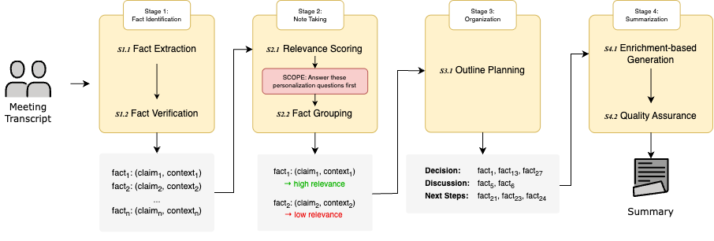
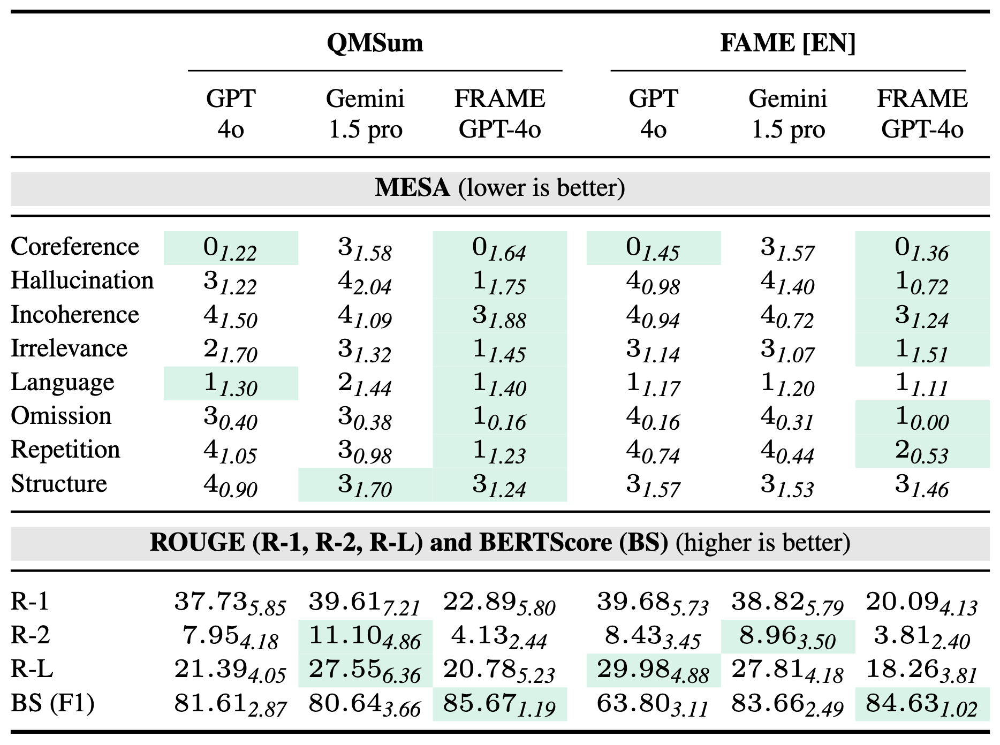
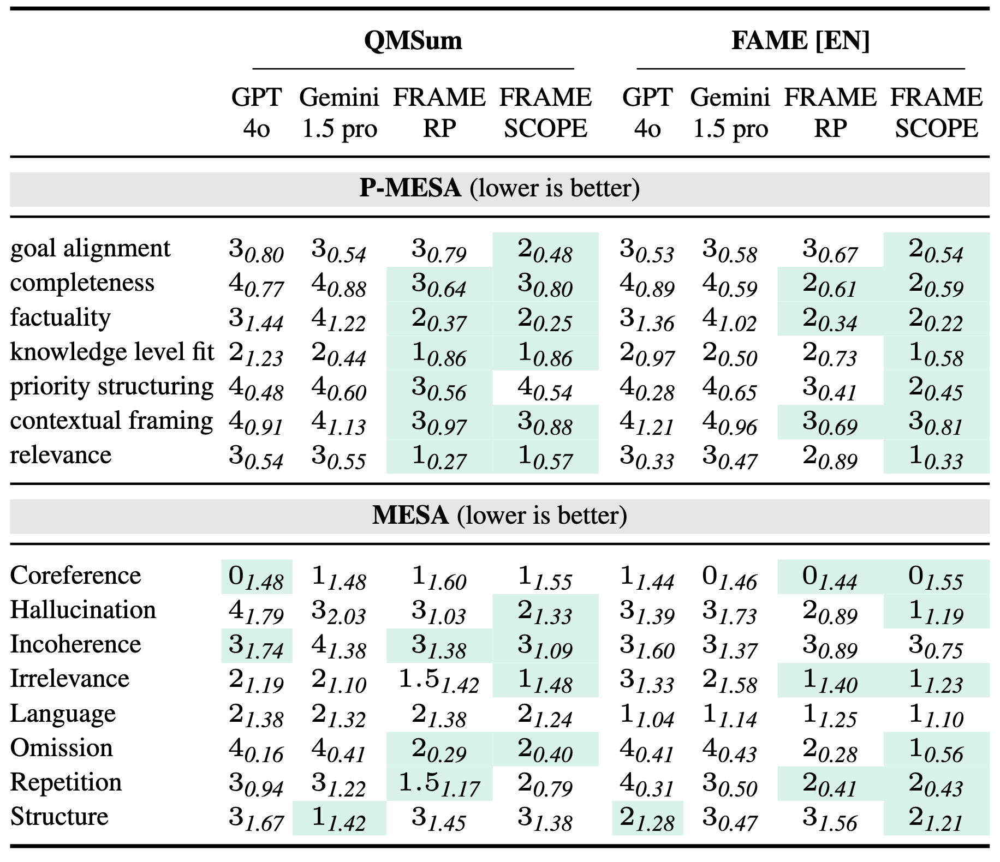

# Re-FRAME the Meeting Summarization SCOPE: Fact-Based Summarization and Personalization via Questions

This software project accompanies the research paper, [Re-FRAME the Meeting Summarization SCOPE: Fact-Based Summarization and Personalization via Questions](https://aclanthology.org/2025.findings-emnlp.1094/). This paper has been accepted to EMNLP 2025 Findings.

<p align="center">



<em>The FRAME pipeline with SCOPE integration (Figure 1 from the paper).</em>
</p>

## 🎯 The Challenge

Summarizing meetings with Large Language Models (LLMs) remains a significant challenge, with outputs often suffering from:

* **Factual Errors**: Hallucinations and contradicted information.

* **Content Gaps**: Omission of key points and decisions.

* **Irrelevance**: Inclusion of filler content.

These issues stem from a core problem: models treat chaotic, multi-speaker conversations as linear text, failing to reconstruct the underlying meaning. Furthermore, they produce "one-size-fits-all" summaries that ignore a key meeting challenge: Salience Ambiguity (i.e., what's important varies for each participant).

## 🎬 Our Solution: FRAME & SCOPE

We propose a new approach that reframes summarization from compression to enrichment and introduces a novel protocol for personalization.

### 1. FRAME: Fact-based Reconstruction Pipeline

FRAME (Fact-based Reconstruction and Abstractive Meeting Summarization) is a modular, fact-centric pipeline that mimics how humans analyze and summarize content.

**Key Features**:

* 4-Stage Pipeline: 1. Fact Identification → 2. Note-Taking → 3. Organization → 4. Summarization.

* Fact-Centric: Extracts, verifies, scores, and groups self-contained facts before generation.

* Enrichment, Not Blind Compression: Builds a summary by enriching a structured fact-based outline, not by compressing the raw transcript.

* Grounded Generation: Constrains the final summary to verified facts, dramatically reducing hallucinations and omissions.

### 2. SCOPE: Personalization via Reason-Out-Loud

SCOPE (Summarizing Content Oriented to Personal Expectations) is a protocol to guide an LLM in creating personalized summaries that address a specific reader's needs.

**Key Features**:

* Reason-Out-Loud: Based on cognitive science, SCOPE has the LLM "think aloud" before selecting content.

* 9-Question Protocol: The LLM builds an explicit reasoning trace by answering questions about the reader's goals, expertise, and knowledge gaps.

* Models Why: This reasoning trace grounds content selection, allowing the model to understand why a piece of information matters to a specific user.

### 📊 P-MESA: A New Metric for Personalization

To evaluate our solution, we created P-MESA (Personalized MEeting Summary Assessor), a new reference-free evaluation framework.

* 7 Dimensions: Assesses summary quality across Factuality, Completeness, Relevance, Goal Alignment, Priority Structuring, Knowledge-level Fit, and Contextual Framing.

* Human-Aligned: Reliably identifies error instances (>89% balanced accuracy) and strongly aligns with human severity ratings (Spearman's $\rho \ge 0.70$).

## 🔬 Key Results

### General Summarization (FRAME)

By reframing summarization as enrichment, FRAME significantly improves faithfulness over strong baselines.


<p align="center">


<em>Results of general summarization of QMSum and FAME. Values are MedianStd. MESA scores are 1–5 Likert ratings, ROUGE (R-1/R-2/R-L) and BERTScore (BS) are 0–100. Green is best in category.</em>
</p>


### Personalized Summarization (SCOPE)

SCOPE guides the model to produce summaries that are genuinely tailored to the reader, outperforming standard role-playing prompts.


<p align="center">


<em>Personalized summarization of QMSum and FAME.  Values are MedianStd. MESA scores are 1–5 Likert ratings, ROUGE (R-1/R-2/R-L) and BERTScore (BS) are 0–100. Green is best in category.</em>
</p>


## 🚀 Quick Start
```bash
# Clone the repository
git clone [https://github.com/FKIRSTE/emnlp2025-reframe-summarization.git](https://github.com/FKIRSTE/emnlp2025-reframe-summarization.git)
cd emnlp2025-reframe-summarization

# Run FRAME summarization
python general_summary/Scripts/run_pipeline.py

# Run FRAME + SCOPE personalization
python personalized_summaries/Scripts/run_pipeline.py

# Evaluate a summary with P-MESA
python P-MESA/src/mesa_persona.py
```


## 💬 Citation
```
@inproceedings{kirstein-etal-2025-frame,
    title = "Re-{FRAME} the Meeting Summarization {SCOPE}: Fact-Based Summarization and Personalization via Questions",
    author = "Kirstein, Frederic  and
      Kumar, Sonu  and
      Ruas, Terry  and
      Gipp, Bela",
    editor = "Christodoulopoulos, Christos  and
      Chakraborty, Tanmoy  and
      Rose, Carolyn  and
      Peng, Violet",
    booktitle = "Findings of the Association for Computational Linguistics: EMNLP 2025",
    month = nov,
    year = "2025",
    address = "Suzhou, China",
    publisher = "Association for Computational Linguistics",
    url = "https://aclanthology.org/2025.findings-emnlp.1094/",
    pages = "20087--20137",
    ISBN = "979-8-89176-335-7"
}
```

<p align="center">
<b>Questions?</b> Open an issue or contact <a href="mailto:kirstein@gipplab.org">kirstein@gipplab.org</a>
</p>