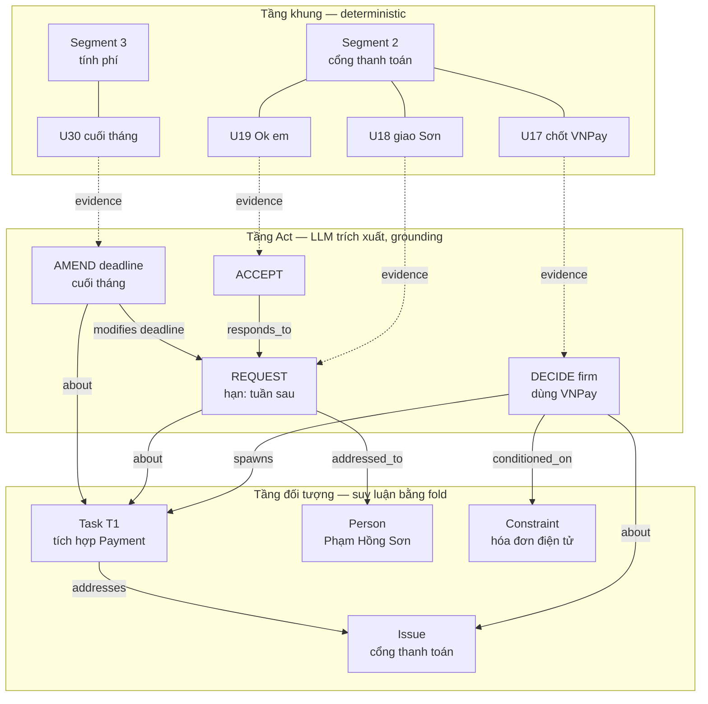
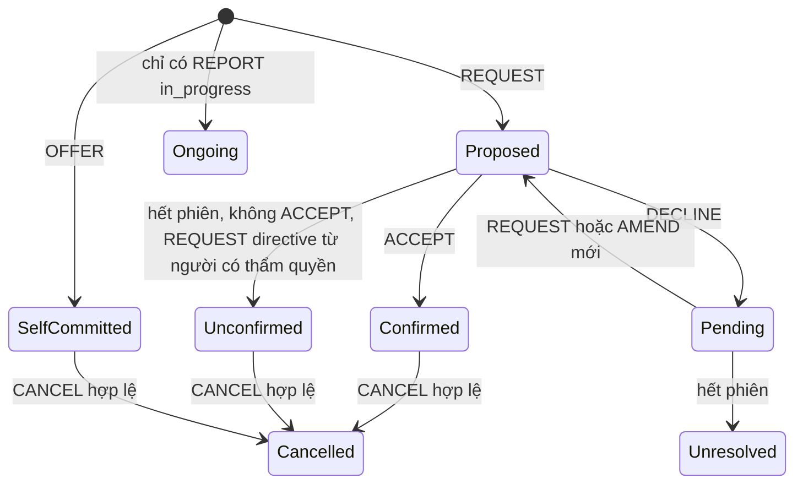
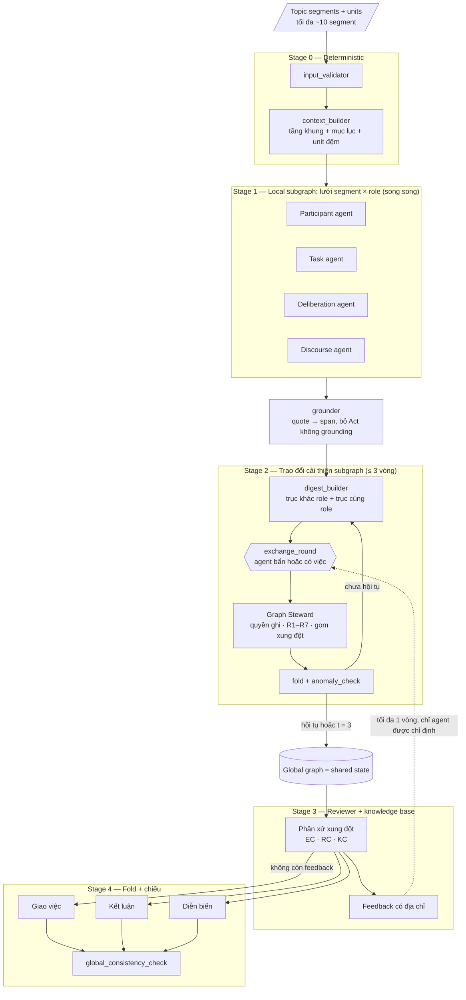
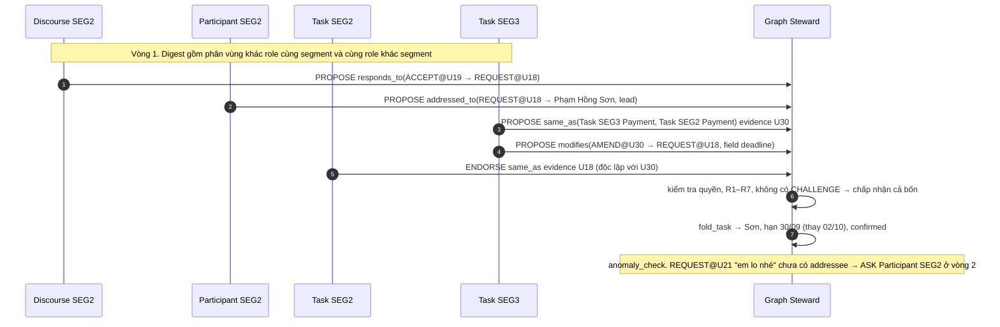

# SPEC — Multi-Agent Meeting Reasoning Graph (MA-MRG)

> Lớp downstream nhận output của topic segmentation và sinh ba sản phẩm: **Giao việc**, **Kết luận họp**, **Diễn biến họp**.
> Trạng thái: bản nháp **v0.4** (bước Plan). Các ngưỡng là giá trị khởi điểm, cần hiệu chỉnh sau pilot.
>
> **Thay đổi so với v0.3:**
>
> - **Graph ba tầng:** tầng khung (Segment, Unit), tầng hành vi hội thoại (Act), tầng đối tượng (Task, Issue, Person, Constraint). LLM chỉ trích xuất Act và cạnh. Task và Issue **không được trích thẳng** mà là kết quả **gấp (fold) chuỗi Act theo luật**.
> - **Giao việc và Kết luận được suy ra bằng luật trên graph**, không do LLM viết từ graph. Mọi trường output đều có `fold_trace` truy ngược về Act và unit.
> - **Lưới agent segment × role** theo khung MASGR: bốn role agent (Participant, Task, Deliberation, Discourse) chạy trên mỗi segment. Mỗi subgraph là một **phân vùng** của shared state.
> - **Trao đổi hai trục:** khác role cùng segment, và cùng role khác segment.
> - **Reviewer** phân xử theo knowledge base, rồi feedback **có địa chỉ** tối đa 1 vòng. Đây là mở rộng so với MASGR (xem 1.2).
> - **Diễn biến** được dựng từ thread `responds_to`.
> - Thêm đánh giá **oracle-Act** để tách lỗi trích xuất khỏi lỗi suy luận.

---

## 1. Bối cảnh

### 1.1 Lỗi quan sát được

| #   | Lỗi                                                              | Được xử lý ở                                                                 |
| --- | ---------------------------------------------------------------- | ---------------------------------------------------------------------------- |
| L1  | Gần hết turn gán cho một speaker; "Sơn" và "Phạm Hồng Sơn" bị trộn | Participant agent, luật speaker không tin cậy, canonical Person              |
| L2  | Một việc (Payment) xuất hiện ở 2 topic, lệch actor/deadline       | Task agent trao đổi cùng role khác segment; fold với AMEND thay thế           |
| L3  | Cùng nội dung vừa là decision vừa là assignment                   | DECIDE và REQUEST là hai Act khác nhau, nối bằng `spawns` (R1)              |
| L4  | Issue còn mở bị ghi "Thống nhất"                                  | DECIDE mang `firmness`, `alternative_to`, fold trạng thái Issue             |
| L5  | Thuật ngữ ASR ra hai dạng chuẩn hóa                               | Knowledge base lexicon                                                       |
| L6  | Báo cáo bug bị hiểu thành yêu cầu                                 | Act `REPORT` tách khỏi `REQUEST`; `REPORT —raises→ Issue`                    |
| L7  | Nội dung giá API nằm trong topic POC                              | Deliberation agent trao đổi cùng role khác segment                          |
| L8  | Debate kích hoạt theo từ vựng                                     | Xung đột có cấu trúc → Reviewer                                              |

### 1.2 Đối chiếu với MASGR

| MASGR (Peng et al., arXiv:2608.30938)                                        | MA-MRG                                                                                                           |
| ---------------------------------------------------------------------------- | ---------------------------------------------------------------------------------------------------------------- |
| Stage 1: 4 doctor agent, mỗi agent đọc **riêng** một loại dữ liệu, sinh local graph | Stage 1: 4 role agent chạy trên **từng segment**, cùng đọc một đoạn transcript, sinh phân vùng subgraph          |
| Stage 2: mỗi vòng, agent đọc graph của agent khác và tự cập nhật; 4 quan hệ; hội tụ ở vòng 3 | Stage 2: như MASGR, thêm trục cùng role khác segment; thao tác đồ thị có kiểu; tối đa 3 vòng                     |
| Gộp thành **tập** global graph ứng viên                                      | Gộp thành **một** global graph; tính mơ hồ được giữ **cục bộ** tại từng xung đột                                 |
| Stage 3: expert agent + knowledge base **chấm và chọn** graph tốt nhất, không quay lại sub-agent | Stage 3: Reviewer + knowledge base **phân xử từng xung đột** và **feedback** có địa chỉ tối đa 1 vòng (mở rộng) |
| Đầu ra: một nhãn khoa, suy từ đường chẩn đoán                                | Đầu ra: ba sản phẩm, suy bằng **fold theo luật**                                                                 |

Vì bốn role agent cùng đọc một văn bản, Stage 2 phải làm thêm việc mà MASGR không cần: **hòa giải các span bị hai role cùng trích**. Việc này được kiểm soát bằng ràng buộc R1 (mục 4.6).

### 1.3 Nguyên lý thiết kế

| #  | Nguyên lý                              | Hệ quả                                                                                           |
| -- | -------------------------------------- | ------------------------------------------------------------------------------------------------ |
| P1 | Một shared state duy nhất              | Subgraph là phân vùng theo `(segment, role)`, không phải bản sao                                 |
| P2 | LLM dựng Act, luật suy ra output       | Output kiểm chứng được, test được khi chưa có dữ liệu, giải thích được từng trường                |
| P3 | Mọi Act đều grounding                  | Act không có evidence hợp lệ bị bỏ                                                                |
| P4 | Giao tiếp bằng thao tác đồ thị có kiểu | Không có hội thoại tự do giữa agent                                                               |
| P5 | Bằng chứng độc lập (chống herding)     | Agent không thấy `rationale` của nhau; ENDORSE phải dùng evidence khác                            |
| P6 | Rule trước LLM                         | Schema, quyền ghi, dry-run ràng buộc, fold đều là rule                                            |
| P7 | Audit và replay                        | Board log, review log, fold trace                                                                 |

---

## 2. Phạm vi

**Trong phạm vi:** transcript đã segment (tối đa khoảng 10 segment mỗi phiên) → global graph → Giao việc, Kết luận, Diễn biến. Bao gồm suy luận vai trò khi diarization sai và chuẩn hóa deadline.

**Ngoài phạm vi:** cải thiện ASR/diarization ở tầng âm thanh; chương trình họp và tài liệu đính kèm (schema chừa `source_type`, xem 14); streaming.

**Ràng buộc quy mô:** phiên có thể dài 128K–200K token. **Không agent nào đọc toàn bộ transcript.** Mọi lời gọi LLM chỉ nhận một segment (kèm unit đệm) hoặc digest rút gọn.

---

## 3. Đầu vào

Giữ nguyên hợp đồng dữ liệu v0.2 / v0.3.

```json
{
  "meeting_meta": { "meeting_id": "string", "meeting_date": "YYYY-MM-DD", "chair": "string | null", "participants": ["string"] },
  "units": [{ "unit_id": "UNIT_000001", "speaker_asr": "string | null", "text": "string", "t_start": 0.0, "t_end": 0.0, "source_ref": "string" }],
  "segments": [{ "segment_id": "TOPIC_SEG_000001", "unit_ids": ["UNIT_000001"], "t_start": 0.0, "t_end": 0.0 }],
  "topic_labels": [{ "segment_id": "TOPIC_SEG_000001", "title": "string", "summary": "string" }],
  "topic_map": {
    "memberships": [["TOPIC_SEG_000001", "TOPIC_000001"]],
    "decisions": [{ "source_segment_id": "string", "target_segment_id": "string", "same_topic": true, "relation": "string" }]
  }
}
```

- Unit = một STT item, là đơn vị neo evidence.
- Mọi segment bắt buộc có `segment_id` và `unit_ids`, phủ kín và không chồng lấn (M0).
- `meeting_date` bắt buộc cho chuẩn hóa deadline.

---

## 4. Schema của graph

### 4.1 Ba tầng



| Tầng     | Ai tạo                                  | Vai trò                                                   |
| -------- | --------------------------------------- | --------------------------------------------------------- |
| Khung    | `context_builder` (rule)                | Địa chỉ evidence; Segment là node hạng nhất; trục thời gian |
| Act      | Role agent (LLM) + `grounder` (rule)    | Hành vi hội thoại có kiểu, là **nguyên liệu** suy luận    |
| Đối tượng | Task/Issue stub do role agent tạo; nội dung do fold tính | Đơn vị của output                                         |

### 4.2 Tầng khung

```json
{
  "node_type": "Segment",
  "segment_id": "TOPIC_SEG_000002",
  "order": 2,
  "title": "string",
  "summary": "string",
  "topic_id": "TOPIC_000002",
  "t_start": 0.0,
  "t_end": 0.0,
  "unit_ids": ["string"]
}
```

```json
{
  "node_type": "Unit",
  "unit_id": "UNIT_000018",
  "segment_id": "TOPIC_SEG_000002",
  "text": "string",
  "speaker_asr": "string | null",
  "speaker_reliable": true,
  "t_start": 0.0,
  "t_end": 0.0
}
```

`speaker_reliable = false` khi `speaker_asr` thuộc nhóm bị nghi diarization gộp (một speaker chiếm hơn 80% unit), hoặc khi Participant agent phát hiện mâu thuẫn giữa nội dung và speaker.

### 4.3 Tầng Act

Trường chung của mọi Act:

```json
{
  "act_id": "TOPIC_SEG_000002:task:a1",
  "act_type": "string",
  "owner": { "segment_id": "TOPIC_SEG_000002", "role": "task" },
  "evidence": [{ "unit_id": "UNIT_000018", "span": [0, 0], "quote": "string" }],
  "t_start": 0.0,
  "t_end": 0.0,
  "speaker": { "canonical_name": "string | null", "source": "inferred | asr | unknown" },
  "slots": {},
  "confidence": 0.0,
  "provenance": ["msg_id"]
}
```

Act giao việc, do **Task agent** tạo:

| `act_type` | Ý nghĩa                        | `slots` bắt buộc / tùy chọn                                                                                                |
| ---------- | ------------------------------ | -------------------------------------------------------------------------------------------------------------------------- |
| `REQUEST`  | Giao việc                      | `task_text`; `addressees: [{mention, role: lead \| support}]`; `deadline_raw?`; `deliverable?`; `directive: bool` (câu chỉ đạo, không cần đáp) |
| `OFFER`    | Tự nhận việc                   | `task_text`; `deadline_raw?`; `deliverable?`                                                                               |
| `ACCEPT`   | Chấp nhận                      | —                                                                                                                          |
| `DECLINE`  | Từ chối / xin lùi              | `reason?`                                                                                                                  |
| `AMEND`    | Sửa một trường của việc        | `field: assignee \| deadline \| scope \| deliverable`; `new_value_raw`                                                     |
| `CANCEL`   | Hủy việc                       | `reason?`                                                                                                                  |
| `REPORT`   | Báo cáo tiến độ / quan sát     | `progress: done \| in_progress \| blocked \| observation`; `content`                                                       |

Act thảo luận, do **Deliberation agent** tạo:

| `act_type` | Ý nghĩa                  | `slots`                                          |
| ---------- | ------------------------ | ------------------------------------------------ |
| `RAISE`    | Nêu vấn đề               | `issue_text`                                     |
| `PROPOSE`  | Đề xuất phương án        | `option_text`                                    |
| `SUPPORT`  | Ủng hộ phương án         | `content`                                        |
| `OBJECT`   | Phản biện phương án      | `content`                                        |
| `DECIDE`   | Chốt                     | `decision_text`; `firmness: firm \| hedged`      |
| `DEFER`    | Hoãn tường minh          | `until_raw?`                                     |
| `REOPEN`   | Mở lại vấn đề đã chốt    | `content`                                        |

**Participant agent** không tạo Act mới. Nó gán `speaker` cho Act, giải `addressees[].mention` thành Person, và đánh dấu `speaker_reliable` cho unit.

**Discourse agent** không tạo Act mới. Nó tạo cạnh `responds_to` giữa Act và nhóm Act thành **Thread** (4.4).

### 4.4 Tầng đối tượng

| Node         | Tạo bởi                                            | Nội dung                                                                                  |
| ------------ | -------------------------------------------------- | ----------------------------------------------------------------------------------------- |
| `Task`       | Task agent tạo **stub** cục bộ; Stage 2 nối `same_as` | Chỉ có `task_id`, `label`. Mọi trường khác do `fold_task` tính (5.1)                      |
| `Issue`      | Deliberation agent tạo stub; Stage 2 nối `same_as` | Chỉ có `issue_id`, `label`. Trạng thái do `fold_issue` tính (5.2)                         |
| `Person`     | Participant agent + knowledge base                 | `canonical_name`, `surface_forms[]`, `role` (chair/member/external), `unit_or_org?`       |
| `Constraint` | Deliberation agent                                 | `content`, `value`                                                                        |
| `Thread`     | Discourse agent                                    | `kind: report_qa \| proposal_debate \| assignment \| other`, `act_ids[]`, `segment_id`     |

### 4.5 Cạnh

| Cạnh             | Nguồn → Đích                        | Họ (MASGR) | Role tạo                         |
| ---------------- | ----------------------------------- | ---------- | -------------------------------- |
| `in_segment`     | Unit → Segment                      | —          | rule                             |
| `evidence_of`    | Unit → Act                          | —          | grounder                         |
| `about`          | Act → Task / Issue                  | —          | Task, Deliberation               |
| `responds_to`    | Act → Act (trước đó)                | Context    | Discourse                        |
| `modifies`       | AMEND → REQUEST/OFFER/AMEND         | Exclusion  | Task                             |
| `addressed_to`   | REQUEST/AMEND → Person (`role`)     | —          | Participant                      |
| `spoken_by`      | Act → Person                        | —          | Participant                      |
| `raises`         | REPORT → Issue                      | Cascade    | Deliberation (đọc Act của Task)  |
| `spawns`         | DECIDE → Task                       | Cascade    | Deliberation / Task              |
| `addresses`      | Task → Issue                        | Cascade    | Task                             |
| `alternative_to` | PROPOSE ↔ PROPOSE (cùng Issue)      | Exclusion  | Deliberation                     |
| `targets`        | SUPPORT/OBJECT/DECIDE → PROPOSE     | Syndrome / Exclusion | Deliberation           |
| `conditioned_on` | DECIDE / Task → Constraint          | Context    | Deliberation                     |
| `same_as`        | Task ↔ Task, Issue ↔ Issue          | Syndrome   | Stage 2                          |
| `in_thread`      | Act → Thread                        | —          | Discourse                        |

Cách dùng bốn họ quan hệ của MASGR trong suy luận:

- **Cascade:** REPORT → RAISE → DECIDE → spawns Task. Dùng cho mục "căn cứ" của Kết luận và cho điều kiện thừa hưởng của Task.
- **Syndrome:** nhiều Act độc lập cùng `about` một Task/Issue. Dùng cho `corroboration`.
- **Exclusion:** OBJECT, `alternative_to`, AMEND thay thế. Dùng cho trạng thái Issue và giá trị cuối của Task.
- **Context:** `conditioned_on`, và ACCEPT/DECLINE chỉ có nghĩa qua `responds_to`.

### 4.6 Ràng buộc toàn vẹn

- **R1:** hai Act cùng span với cùng nội dung không được đồng thời là `DECIDE` và `REQUEST`. Nếu một câu vừa chốt vừa giao ("thống nhất dùng VNPay, Sơn làm"), đó là hai Act có nội dung khác nhau và **phải** nối `DECIDE —spawns→ Task`.
- **R2:** sau Stage 2, mọi Act giao việc có đúng một `about → Task`, mọi Act thảo luận có đúng một `about → Issue`. Act mồ côi được gắn cờ A11.
- **R3:** `ACCEPT`, `DECLINE` và `AMEND` phải có `responds_to` hoặc `modifies` trỏ tới Act **sớm hơn**.
- **R4:** `same_as` chỉ nối cùng loại node.
- **R5:** mỗi Person có đúng một `canonical_name`; mọi output dùng `canonical_name`.
- **R6:** cạnh theo thời gian (`responds_to`, `modifies`) chỉ trỏ ngược thời gian. Không có chu trình.
- **R7:** mỗi Act có đúng một owner `(segment, role)`. Chỉ owner được sửa Act đó.

---

## 5. Suy luận trên graph (fold)

Fold là **rule thuần**, chạy sau Stage 3. Fold cũng chạy lại sau mỗi vòng Stage 2 để `anomaly_check` có trạng thái mới nhất.

### 5.1 Giao việc: `fold_task`

```python
def fold_task(task_id: str, graph: "MeetingGraph", kb: "MeetingKnowledgeBase") -> "TaskView":
    """
    Chức năng: gấp chuỗi Act của một Task (sau khi gộp same_as) thành một dòng giao việc.
    Đầu vào:
        task_id: id Task đại diện của cụm same_as
        graph: global graph đã qua Stage 3
        kb: knowledge base (luật thẩm quyền, chính sách chấp nhận, luật thay thế)
    Đầu ra:
        TaskView gồm assignees (lead/support), assigner, deadline, deliverable, assignment_status,
        condition, lịch sử giá trị bị thay thế (superseded) và fold_trace cho từng trường.
    """
    acts = sorted(graph.acts_about(task_id), key=lambda act: act.t_start)
    view = TaskView(task_id)
    for act in acts:
        if act.act_type == "REQUEST":
            view.open_request(act, assignees=graph.addressees(act), assigner=graph.speaker_or_authority(act, kb))
        elif act.act_type == "OFFER":
            view.self_commit(act, assignee=graph.speaker(act))
        elif act.act_type == "ACCEPT":
            view.confirm(graph.responds_to(act))
        elif act.act_type == "DECLINE":
            view.decline(graph.responds_to(act))
        elif act.act_type == "AMEND" and kb.amend_is_authorized(act, view, graph):
            view.supersede(field=act.slots["field"], raw_value=act.slots["new_value_raw"], by=act)
        elif act.act_type == "CANCEL" and kb.cancel_is_authorized(act, view, graph):
            view.cancel(act)
        elif act.act_type == "REPORT":
            view.add_progress(act)
    view.assignment_status = kb.resolve_assignment_status(view)
    view.condition = graph.inherited_condition(task_id)   # qua DECIDE -spawns-> Task -conditioned_on-> Constraint
    view.deadline = normalize_deadline(view.deadline_raw, graph.meeting_date)
    return view
```

Luật theo từng trường:

| Trường      | Luật                                                                                                                                                                         |
| ----------- | ---------------------------------------------------------------------------------------------------------------------------------------------------------------------------- |
| Người nhận  | `addressed_to` của REQUEST (tách `lead` / `support`). OFFER → người nói. `AMEND(assignee)` hợp lệ thì thay thế.                                                             |
| Người giao  | Người nói của REQUEST nếu `speaker_reliable`. Nếu không: người có thẩm quyền theo knowledge base (chủ trì) khi REQUEST có `directive = true`. Còn lại: null.                |
| Hạn         | Giá trị của Act hợp lệ muộn nhất. AMEND hợp lệ khi người nói có thẩm quyền, hoặc được ACCEPT. Giá trị cũ vào `superseded`.                                                  |
| Điều kiện   | Thừa hưởng qua `DECIDE —spawns→ Task —conditioned_on→ Constraint`.                                                                                                          |
| `fold_trace` | Với mỗi trường: danh sách `(act_id, unit_id, luật áp dụng)`. Ví dụ: `deadline ← AMEND@U30 (supersession.later_same_authority), thay REQUEST@U18`.                           |

Trạng thái giao việc:



| `assignment_status` | Đưa vào Giao việc?          | Ghi chú                                      |
| ------------------- | --------------------------- | -------------------------------------------- |
| `confirmed`         | có                          |                                              |
| `unconfirmed`       | có, gắn cờ                  | **Mặc định v0.4** cho chỉ đạo không có đáp   |
| `self_committed`    | có                          |                                              |
| `ongoing`           | có, mục riêng               |                                              |
| `pending` / `unresolved` | không, vào cảnh báo    | Việc bị từ chối chưa giao lại                |
| `cancelled`         | không, vào ghi chú          |                                              |

### 5.2 Kết luận: `fold_issue`

Các Act `about` một Issue được sắp theo thời gian. Trạng thái xác định theo thứ tự ưu tiên:

| Ưu tiên | Trạng thái             | Điều kiện                                                                                                    |
| ------- | ---------------------- | ------------------------------------------------------------------------------------------------------------ |
| 1       | (override)             | Reviewer quyết kèm evidence                                                                                  |
| 2       | `deferred`             | Có `DEFER` và không có `DECIDE firm` sau đó                                                                  |
| 3       | `open`                 | Không có `DECIDE firm`                                                                                       |
| 4       | `open` + A9            | Có `DECIDE firm` nhắm vào ≥ 2 PROPOSE cùng nhóm `alternative_to`                                             |
| 5       | `open` + A4            | Có `OBJECT` nhắm vào phương án được chốt, hoặc có `REOPEN`, **sau** `DECIDE firm` muộn nhất                   |
| 6       | `resolved_conditional` | `DECIDE firm` có `conditioned_on`                                                                            |
| 7       | `resolved`             | Còn lại                                                                                                      |

- `DECIDE hedged` ("có thể mình chốt") **không** được tính là chốt, nhưng gắn cờ A6 để Reviewer xem xét.
- PROPOSE `alternative_to` với phương án được chốt, xuất hiện lại sau thời điểm chốt → A10.
- Issue `open` phải có ít nhất một Task `addresses`; nếu không có → `owner_missing` (A5).
- `basis` (căn cứ) = các REPORT `raises` Issue, theo chuỗi Cascade.

### 5.3 Diễn biến: `fold_thread`

- Mỗi Thread là một chuỗi Act nối bằng `responds_to` trong một segment. Thread có `kind` gồm: báo cáo–hỏi đáp, đề xuất–tranh luận–chốt, giao–xác nhận.
- Mỗi Thread được chiếu thành một lượt diễn biến gồm: người mở đầu, các phản hồi, và kết cục (tham chiếu Issue/Task mà Thread dẫn tới).
- Người nói: `canonical_name` nếu có `speaker.source = inferred`, hoặc `asr` mà unit có `speaker_reliable = true`. Ngược lại dùng nhãn trung tính "một thành viên".
- Realizer (LLM) chỉ diễn đạt từng Thread thành câu. Nó không thêm Act và không đọc lại transcript.

---

## 6. Kiến trúc multi-agent

### 6.1 Tổng quan



### 6.2 Stage 0 — deterministic

- `input_validator`: chặn chạy nếu vi phạm hợp đồng M0.
- `context_builder`: dựng tầng khung (Segment, Unit), mục lục phiên họp (Segment: order, title, summary, topic_id), cửa sổ trích xuất mỗi segment (core + k = 2 unit đệm mỗi đầu), đánh dấu `speaker_reliable` ban đầu theo tỷ lệ chiếm của speaker.

### 6.3 Stage 1 — lưới segment × role

Mỗi segment chạy bốn role agent song song. Tổng số lời gọi ≤ 4 × số segment (≤ 40).

| Role agent   | Input                                         | Output (vào phân vùng của mình)                                                     |
| ------------ | --------------------------------------------- | ----------------------------------------------------------------------------------- |
| Participant  | Unit của segment (kèm speaker_asr), `participants`, `chair`, lexicon | `spoken_by`, `addressed_to` (giải mention), Person mới, cờ `speaker_reliable`        |
| Task         | Unit của segment, mục lục                     | Act giao việc (5.1), Task stub, `about`, `modifies`, `addresses` (nếu Issue cùng segment rõ) |
| Deliberation | Unit của segment, mục lục                     | Act thảo luận, Issue stub, `about`, `alternative_to`, `targets`, `conditioned_on`, Constraint |
| Discourse    | Unit của segment                              | `responds_to` giữa **unit** (được chuyển sang Act ở Stage 2), Thread thô             |

- Mọi Act kèm `{unit_id, quote}` nguyên văn. `grounder` xác định span bằng rule (chuẩn hóa + fuzzy ≥ 0.9), retry một lần, không khớp thì bỏ.
- Unit đệm được đánh dấu `[NGỮ CẢNH]`, không được làm evidence duy nhất của một Act.
- Nội dung nhắc tới topic của segment khác thì ghi `ref_segment_id` (gợi ý cho trục cùng role khác segment).
- Discourse agent chạy trên unit vì ở Stage 1 nó chưa thấy Act của role khác. Trục khác role ở Stage 2 sẽ chuyển `responds_to(unit → unit)` thành `responds_to(Act → Act)`.

### 6.4 Stage 2 — trao đổi cải thiện subgraph

**Phân vùng.** Shared state được chia theo owner `(segment, role)`. Agent chỉ ghi vào phân vùng của mình (R7) và đọc được mọi phân vùng qua digest.

**Hai trục trao đổi:**

| Trục                         | Ai đọc ai                                          | Việc điển hình                                                                                                        |
| ---------------------------- | -------------------------------------------------- | --------------------------------------------------------------------------------------------------------------------- |
| **Khác role, cùng segment**  | Mỗi role đọc 3 role còn lại của cùng segment        | Task nối ACCEPT → REQUEST nhờ `responds_to` của Discourse; Task điền người nhận nhờ `addressed_to` của Participant; Deliberation nối `DECIDE —spawns→ Task`; Deliberation nối `REPORT —raises→ Issue`; hòa giải span trùng theo R1 |
| **Cùng role, khác segment**  | Task ↔ Task, Deliberation ↔ Deliberation, Participant ↔ Participant của các segment liên quan | Task SEG3 nối `AMEND@U30` vào Task Payment của SEG2 (`same_as` + `modifies`); Deliberation SEG1 nhận ra "giá API" là Issue ở SEG3; Participant thống nhất "Sơn" = "Phạm Hồng Sơn" |

**Phạm vi trục cùng role.** Vì mỗi phiên có tối đa khoảng 10 segment (≤ 45 cặp), mặc định **mọi cặp segment** đều trao đổi ở vòng 1. `topic_map` chỉ dùng để xếp ưu tiên nội dung digest khi digest vượt ngân sách token. Vòng 2 trở đi chỉ trao đổi giữa các cặp có thay đổi ở vòng trước.

**Digest.** Mỗi agent được kích hoạt nhận:

- (a) Act và stub của các phân vùng liên quan ở dạng rút gọn `{act_id, act_type, slots chính, 1 quote, t}`;
- (b) work item từ `anomaly_check`;
- (c) các PROPOSE của vòng trước chạm vào phân vùng của mình (chỉ payload và evidence, **không** kèm `rationale`).

Digest có ngân sách token cố định (mặc định 4K). Nếu vượt, ưu tiên theo thứ tự: cùng `topic_id` > `ref_segment_id` > gần về thời gian.

**Message** (giữ giao thức v0.3):

| Loại        | Dùng khi                                                   | Điều kiện hợp lệ                                                   |
| ----------- | ---------------------------------------------------------- | ------------------------------------------------------------------ |
| `PROPOSE`   | Thêm/sửa/xóa Act, stub, cạnh trong phân vùng của mình, hoặc cạnh xuyên phân vùng có nguồn là node của mình | Grounding được; đúng quyền; dry-run không tăng vi phạm R1–R7 |
| `CHALLENGE` | Phản đối PROPOSE chạm vào phân vùng của mình               | Có counter-evidence grounding được                                  |
| `ENDORSE`   | Xác nhận PROPOSE                                           | Evidence không giao với evidence gốc; khác tác giả                   |
| `ASK`       | Nhờ agent khác xử lý (vd Task nhờ Participant giải "em")  | Có agent đích; thành work item vòng sau                             |

**Graph Steward** (rule) xử lý theo thứ tự: grounding → quyền → schema → dry-run R1–R7. PROPOSE không có CHALLENGE thì được chấp nhận. PROPOSE có CHALLENGE, hoặc có PROPOSE cạnh tranh trên cùng target, thì thành **xung đột**, được giữ lại cho Reviewer. Trong lúc chờ, target mang cả hai phương án ở trạng thái `contested`, và fold dùng phương án hiện hành kèm cờ.

**Hội tụ:** vòng không có PROPOSE nào được chấp nhận và không phát sinh work item mới, hoặc t = 3.

**Ví dụ một vòng (Payment):**



**Chống herding và dao động.**

- Không phát `rationale` giữa các agent.
- ENDORSE chỉ tăng `corroboration`, không tự giải quyết xung đột.
- PROPOSE đã bị từ chối không được gửi lại với cùng `(target, payload)`.
- Quyết định của Reviewer chỉ bị CHALLENGE lại khi có evidence mới.

### 6.5 Global graph

Sau khi Stage 2 hội tụ, global graph là hợp của các phân vùng, trong đó:

- Task/Issue stub nối `same_as` được gom thành cụm, lấy đại diện là stub ở **segment gốc** (stub không có `ref_segment_id`, nếu có nhiều thì lấy stub sớm nhất). `segment_ids` của đại diện là hợp các segment trong cụm.
- Act không bị gộp; mỗi Act vẫn thuộc owner của nó. Chỉ cạnh `about` được trỏ về đại diện.
- Person được gom theo `canonical_name`.

Global graph **không** được LLM viết lại. Nó là kết quả cơ học của các thao tác đã được Steward chấp nhận.

### 6.6 Stage 3 — Reviewer

**Đầu vào:** danh sách xung đột còn lại, anomaly còn lại sau Stage 2, kết quả fold hiện hành, knowledge base.

**(a) Phân xử xung đột.** Với mỗi xung đột, dựng ứng viên (mỗi bó PROPOSE cạnh tranh là một ứng viên, cộng thêm ứng viên "giữ nguyên"), áp thử trên subgraph lân cận 2-hop, rồi chấm:

| Chiều   | Nghĩa                                                                     | Cách chấm                  |
| ------- | ------------------------------------------------------------------------- | -------------------------- |
| EC      | Ứng viên có giải thích được mọi evidence của các phía không               | Rule + LLM xác nhận        |
| RC      | Ứng viên có mâu thuẫn nội tại không: R1–R7, thời gian, fold tự mâu thuẫn   | Rule thuần; vi phạm → loại |
| KC      | Ứng viên có tuân knowledge base không: thẩm quyền, thay thế, chính sách chấp nhận | Rule cứng + LLM cho luật mềm |

`score = 0.35·EC + 0.25·RC + 0.40·KC`. Ứng viên cao điểm nhất thắng. Nếu chênh lệch với ứng viên thứ hai < δ = 0.15 thì vẫn áp dụng nhưng ghi cảnh báo và giữ phương án còn lại trong output.

**(b) Feedback có địa chỉ.** Với những anomaly Reviewer không tự quyết được vì thiếu thông tin, Reviewer phát feedback theo mẫu:

```json
{
  "feedback_id": "FB:003",
  "to": { "segment_id": "TOPIC_SEG_000002", "role": "participant" },
  "about": "act:TOPIC_SEG_000002:task:a4",
  "issue": "REQUEST chưa xác định người nhận ('em lo nhé')",
  "evidence": [{ "unit_id": "UNIT_000021" }],
  "expected": "PROPOSE addressed_to hoặc xác nhận không xác định được",
  "rule": "A1"
}
```

- Chỉ agent nhận feedback được kích hoạt, chạy **một** vòng Stage 2 bổ sung. Sau đó fold lại. Reviewer không lặp lại.
- Feedback không được yêu cầu agent "xem lại toàn bộ". Mỗi feedback phải có `about` và `evidence` cụ thể.
- Biến thể **Reviewer-select** (không feedback, đúng như MASGR) được giữ làm ablation.

### 6.7 Stage 4 — fold và chiếu

Chạy `fold_task`, `fold_issue`, `fold_thread` trên global graph cuối, rồi chiếu thành 3 output (mục 10). Realizer LLM chỉ diễn đạt Thread (Diễn biến) và sinh văn bản Thông báo kết luận từ JSON. Các trường của Giao việc và Kết luận đều do fold quyết định.

---

## 7. Luật bất thường

| ID  | Luật                                                                                       | Xử lý ở Stage 2 (work item)             | Nếu còn ở Stage 3                        |
| --- | ------------------------------------------------------------------------------------------ | --------------------------------------- | ---------------------------------------- |
| A1  | Task không có người nhận sau fold                                                          | ASK Participant của segment chứa REQUEST | Feedback; còn nữa thì "(chưa xác định)" + cảnh báo |
| A2  | Người giao trùng người nhận, không phải OFFER                                              | Participant                             | Phân xử                                  |
| A3  | Hai giá trị cạnh tranh cho cùng trường của Task mà không có AMEND hợp lệ phân định           | Task của các segment liên quan          | Phân xử (KC: luật thay thế)              |
| A4  | OBJECT/REOPEN sau DECIDE firm                                                              | Deliberation                            | Phân xử trạng thái                       |
| A5  | Issue `open` không có Task `addresses`                                                     | — (cờ)                                  | Kết luận: "chưa có người phụ trách"      |
| A6  | DECIDE `hedged`, hoặc DECIDE firm không có cue chốt và không ở cuối segment                  | Deliberation                            | Phân xử; mặc định giữ `open`             |
| A7  | Act chỉ có evidence ở unit đệm, hoặc có `ref_segment_id` mà chưa được nối                   | Cùng role của segment được tham chiếu   | Feedback                                 |
| A8  | Speaker chiếm hơn 80% unit, hoặc tên mơ hồ                                                 | Participant (cùng role khác segment)    | Cờ; Diễn biến dùng nhãn trung tính        |
| A9  | Vi phạm R1, hoặc DECIDE firm cho hai phương án `alternative_to`                            | Task + Deliberation cùng segment        | Phân xử                                  |
| A10 | Phương án thay thế được nhắc lại sau DECIDE                                                | Deliberation                            | Phân xử                                  |
| A11 | Act mồ côi (không có `about`), hoặc ACCEPT/DECLINE không có `responds_to`                   | Owner + Discourse cùng segment          | Feedback; còn nữa thì bỏ khỏi fold + log  |
| A12 | REQUEST không có ACCEPT, người nói không có thẩm quyền và `directive = false`              | Discourse (tìm đáp ở segment sau)       | `unconfirmed` + cảnh báo                 |

---

## 8. Knowledge base

File cấu hình có version, được kiểm định trước khi đánh giá chính thức (1–2 người chấm độc lập trên từng luật).

| Nhóm                    | Nội dung                                                                                                                                          |
| ----------------------- | ------------------------------------------------------------------------------------------------------------------------------------------------- |
| Lexicon ASR             | "mic tinh" → meeting, "pi ai ai" → PII, …                                                                                                         |
| Cue                     | cue chốt, cue hoãn, cue rào đón (xác định `firmness`), token acknowledgment                                                                       |
| Thẩm quyền              | Ai được DECIDE firm, ai được REQUEST/AMEND/CANCEL; khi không biết chủ trì: cue + vị trí cuối segment                                             |
| Chính sách chấp nhận    | **Mặc định:** REQUEST `directive` của người có thẩm quyền không có ACCEPT → `unconfirmed` (vẫn đưa vào Giao việc). Biến thể nghiêm: → không giao |
| Luật thay thế           | AMEND sau của cùng người hoặc người có thẩm quyền cao hơn về cùng trường thì thay thế giá trị trước; AMEND của người nhận chỉ có hiệu lực khi được ACCEPT |
| Thể thức hành chính     | Việc cần đơn vị/người chủ trì (`lead`), phối hợp (`support`), thời hạn; thiếu thì cảnh báo trong Giao việc                                       |
| Deadline                | Tuần bắt đầu thứ Hai; "tuần sau" = thứ Sáu tuần kế; "cuối tháng" = ngày cuối tháng; "A hoặc B" lấy mốc muộn; mốc sự kiện → `precision = event`   |
| Ngưỡng                  | grounding 0.9; speaker dominance 0.8; δ = 0.15; trọng số rubric; T_max = 3; ngân sách digest 4K token                                            |

---

## 9. Hiện thực LangGraph

### 9.1 State

```python
class MeetingGraphState(TypedDict):
    """
    Chức năng: shared state của toàn bộ hệ thống (global graph + board + log).
    Đầu vào: khởi tạo từ output topic segmentation (mục 3).
    Đầu ra: được fold và realizer đọc để sinh 3 sản phẩm.
    """
    # Tầng khung
    meeting_meta: dict
    segments: dict[str, dict]                 # segment_id -> Segment node
    units: dict[str, dict]                    # unit_id -> Unit node
    unit_order: list[str]
    meeting_outline: str
    segment_windows: dict[str, dict]          # core + unit đệm

    # Tầng Act + đối tượng, phân vùng theo owner
    acts: dict[str, dict]                     # act_id -> Act (có owner)
    objects: dict[str, dict]                  # Task/Issue stub, Person, Constraint, Thread
    edges: list[dict]
    grounding_failures: list[dict]

    # Trao đổi (Stage 2)
    round: int
    board: list[dict]
    board_log: list[dict]
    rejected_signatures: list[str]
    work_items: dict[str, list[dict]]         # "segment_id:role" -> việc
    dirty_owners: list[str]
    conflicts: list[dict]

    # Reviewer (Stage 3)
    review_log: list[dict]
    feedback: list[dict]
    feedback_round_used: bool

    # Fold + output
    folded: dict                              # task_views, issue_views, thread_views (có fold_trace)
    anomalies: list[dict]
    outputs: dict
    warnings: list[dict]
```

### 9.2 Node

| Node                       | Loại              | Ghi chú                                                         |
| -------------------------- | ----------------- | --------------------------------------------------------------- |
| `input_validator`          | rule              | M0                                                              |
| `context_builder`          | rule              | Tầng khung, mục lục, cửa sổ, `speaker_reliable` ban đầu          |
| `role_agent_local`         | LLM, `Send` × (segment × role) | Stage 1                                            |
| `grounder`                 | rule              | Quote → span                                                    |
| `digest_builder`           | rule              | Hai trục, ngân sách token, work item                            |
| `exchange_round`           | LLM, `Send`       | Chỉ owner bẩn hoặc có việc                                      |
| `graph_steward`            | rule              | Quyền, R1–R7, xung đột                                          |
| `fold`                     | rule              | `fold_task`, `fold_issue`, `fold_thread`                        |
| `anomaly_check`            | rule              | A1–A12 → work item                                              |
| `route_exchange`           | rule              | Vòng tiếp hoặc sang Reviewer                                    |
| `reviewer`                 | rule + LLM        | Phân xử + feedback                                              |
| `route_feedback`           | rule              | Có feedback và chưa dùng → `exchange_round` (1 lần); ngược lại → chiếu |
| `realize_dien_bien`        | LLM               | Diễn đạt Thread                                                 |
| `realize_giao_viec`, `realize_ket_luan` | rule | Chiếu từ fold                                                   |
| `global_consistency_check` | rule              | Mục 10.4                                                        |

---

## 10. Đặc tả output

### 10.1 Giao việc

```json
{
  "person": "canonical_name | (chưa xác định)",
  "role": "chair | member | external | null",
  "tasks": [
    {
      "task_id": "string",
      "task": "string",
      "deliverable": "string | null",
      "task_role": "lead | support",
      "co_actors": [{ "person": "string", "task_role": "lead | support" }],
      "assigned_by": "string | null",
      "assignment_status": "confirmed | unconfirmed | self_committed",
      "deadline_raw": "string | null",
      "deadline_norm": "YYYY-MM-DD | null",
      "deadline_precision": "day | week | month | event | none",
      "superseded": [{ "field": "deadline", "raw": "tuần sau", "act_id": "string" }],
      "condition": "string | null",
      "addresses_issue": "issue_id | null",
      "segments": ["string"],
      "fold_trace": { "assignee": [], "deadline": [], "assigned_by": [] },
      "warnings": ["string"]
    }
  ],
  "ongoing": [{ "task_id": "string", "task": "string", "progress": "string", "fold_trace": [] }]
}
```

Việc có trạng thái `pending`, `unresolved` hoặc `cancelled` không nằm trong danh sách trên. Chúng được liệt kê ở `warnings` / `notes` của output tổng.

### 10.2 Kết luận

```json
{
  "resolved": [{ "issue_id": "string", "issue": "string", "conclusion": "string", "decided_by": "string | null", "basis": ["string"], "spawned_tasks": ["task_id"], "fold_trace": [] }],
  "resolved_conditional": [{ "issue_id": "string", "issue": "string", "conclusion": "string", "condition": "string", "follow_up": ["task_id"], "basis": ["string"], "fold_trace": [] }],
  "deferred": [{ "issue_id": "string", "issue": "string", "until": "string | null", "fold_trace": [] }],
  "open": [{ "issue_id": "string", "issue": "string", "alternatives": ["string"], "follow_up": ["task_id"], "owner_missing": false, "fold_trace": [] }],
  "warnings": [{ "anomaly_id": "string", "message": "string" }]
}
```

Bản văn "Thông báo kết luận" theo thể thức hành chính được sinh từ JSON này bằng template có sẵn (`Prompt_sinh_thong_bao_ket_luan_hop.md`).

### 10.3 Diễn biến

```json
{
  "segment_id": "string",
  "title": "string",
  "threads": [
    {
      "thread_id": "string",
      "kind": "report_qa | proposal_debate | assignment | other",
      "turns": [
        {
          "act_id": "string",
          "act_type": "string",
          "speaker": "canonical_name | một thành viên",
          "speaker_source": "inferred | asr | unreliable",
          "content": "string",
          "evidence": [{ "unit_id": "string", "span": [0, 0] }]
        }
      ],
      "outcome": { "issue_id": "string | null", "task_ids": ["string"] },
      "narrative": "string (realizer diễn đạt từ turns)"
    }
  ]
}
```

### 10.4 Kiểm tra nhất quán chéo

- Mọi `follow_up` / `spawned_tasks` trong Kết luận có mặt trong Giao việc (hoặc trong ghi chú nếu bị hủy).
- Không Task nào có hai `lead` khác nhau.
- Mọi Issue xuất hiện trong `outcome` của Diễn biến có mặt ở đúng một mục của Kết luận.
- Mọi Task trong `outcome` của Diễn biến có mặt trong Giao việc hoặc ghi chú.
- Mọi trường có giá trị trong Giao việc và Kết luận có `fold_trace` không rỗng.

---

## 11. Đánh giá

### 11.1 Dữ liệu

- **Gold:** biên bản gán nhãn ở tầng Act (loại, `about`, `responds_to`, người nhận) và tầng output (Task, trạng thái Issue).
- **Silver:** bộ ba tài liệu phiên họp Quốc hội.
- **Tổng hợp:** hội thoại sinh có kiểm soát, bao gồm phiên vượt context (~8K, ~128K, ~200K token). Tầng Act được sinh kèm hội thoại, nên có sẵn gold Act.
- **Kiểm thử logic khi chưa có dữ liệu:** các graph Act dựng tay cho từng tình huống: giao + ok em, chỉ đạo không đáp, sửa hạn ở segment khác, từ chối rồi giao lại, hủy, chốt có rào đón, chốt rồi bị phản biện, hai phương án không chốt.

### 11.2 Metric

| Tầng           | Metric                                                                                  | Ngưỡng khởi điểm        |
| -------------- | --------------------------------------------------------------------------------------- | ----------------------- |
| Act            | P/R phát hiện Act; accuracy `act_type` trên Act khớp                                     | R ≥ 0.75, acc ≥ 0.70    |
| Act            | Accuracy `responds_to` (ACCEPT → REQUEST đúng)                                          | ≥ 0.75                  |
| Act            | Accuracy `about` xuyên segment (AMEND → đúng Task)                                      | ≥ 0.70                  |
| Act            | Accuracy `addressed_to` trên REQUEST                                                    | ≥ 0.75                  |
| Grounding      | Act có span hợp lệ / Act bị bỏ                                                          | ≥ 0.95 / ≤ 5%           |
| Giao việc      | F1 bộ ba (người nhận, việc, hạn) sau fold                                                | ≥ 0.65                  |
| Giao việc      | Tỷ lệ việc trùng hoặc tách sai                                                          | ≤ 10%                   |
| Kết luận       | Accuracy trạng thái Issue (4 lớp)                                                       | ≥ 0.75                  |
| Kết luận       | **Recall vấn đề tồn đọng**                                                              | ≥ 0.85                  |
| Kết luận/Giao việc | Recall mục nhỏ nhưng quan trọng (1–2 unit)                                          | báo cáo, so với B-LC    |
| Diễn biến      | Gán người nói đúng trên unit tin cậy; tỷ lệ Thread đúng ranh giới                        | ≥ 0.80 / báo cáo        |
| Hệ thống       | Vi phạm 10.4                                                                            | 0%                      |
| Trao đổi       | Số vòng hội tụ; tỷ lệ chấp nhận / thách thức / bỏ; tỷ lệ xung đột lên Reviewer          | báo cáo                 |
| Reviewer       | Độ đúng phân xử trên xung đột; số feedback được xử lý thành công                         | báo cáo                 |
| Chi phí        | Số lời gọi LLM, token                                                                   | báo cáo                 |

### 11.3 Đánh giá oracle-Act

Vì fold là luật, có thể tách hai nguồn lỗi:

| Chế độ          | Đầu vào fold                                    | Đo được                                   |
| --------------- | ----------------------------------------------- | ----------------------------------------- |
| **Oracle-Act**  | Tầng Act gold                                   | Lỗi của luật fold và knowledge base       |
| **Oracle-link** | Act do hệ thống trích, cạnh `about`/`responds_to` gold | Lỗi do Stage 2 liên kết sai               |
| **End-to-end**  | Toàn bộ do hệ thống sinh                        | Lỗi tổng                                  |

Hiệu giữa Oracle-link và End-to-end cho biết phần đóng góp của Stage 2. Hiệu giữa Oracle-Act và Oracle-link cho biết chất lượng trích xuất Act ở Stage 1.

### 11.4 Ablation

| Nhóm | Cấu hình                                     | Câu hỏi                                                          |
| ---- | -------------------------------------------- | ---------------------------------------------------------------- |
| Mốc  | B0 pipeline cũ; B-LC long-context một lần (chỉ chạy được với phiên vừa context) | Có cần graph không                           |
| Mốc  | **LLM-fold**: LLM đọc global graph rồi viết output thay cho fold luật | Fold bằng luật có đáng không                         |
| Stage 1 | Bỏ từng role agent (dồn việc cho role còn lại, tương ứng Table 3 của MASGR) | Mỗi role đóng góp bao nhiêu                        |
| Stage 1 | Một agent/segment trích mọi thứ, thay cho 4 role | Chia role có hơn không                                         |
| Stage 2 | Không trao đổi (gộp trực tiếp, tương ứng "w/o Multi-Agent" của MASGR) | Có cần trao đổi không                               |
| Stage 2 | Chỉ trục khác role / chỉ trục cùng role      | Trục nào đóng góp                                                |
| Stage 2 | Trao đổi bằng hội thoại tự do (tương ứng "w/o Reasoning Graph") | Thao tác có kiểu có giảm herding/drift không            |
| Stage 2 | T = 1…5 (tương ứng Hình 7 của MASGR)         | Số vòng tối ưu                                                  |
| Stage 2 | Agent thấy `rationale` của nhau              | Hiệu quả chống herding                                          |
| Stage 3 | Không Reviewer; **Reviewer-select** (đúng MASGR); Reviewer + feedback | Feedback có đáng không                                  |
| Stage 3 | Reviewer không dùng knowledge base          | Tương ứng "w/o Referral Knowledge" của MASGR                      |
| Quan hệ | Bỏ từng họ Cascade / Syndrome / Exclusion / Context (tương ứng Hình 5 của MASGR) | Họ nào quan trọng                               |
| Segmentation | S-win, S-seg, S-full, S-gold (như v0.2)  | Đóng góp của segmentation                                        |

Với phiên vượt context (128K, 200K), B-LC không chạy được. Khi đó các mốc so sánh là "không trao đổi" và "một agent/segment".

---

## 12. Milestone (xếp theo rủi ro giảm dần)

| #   | Milestone                                                                 | Tiêu chí hoàn thành                                                                                      |
| --- | ------------------------------------------------------------------------- | -------------------------------------------------------------------------------------------------------- |
| M0  | Hợp đồng dữ liệu + `input_validator`, `context_builder`, `grounder`       | 100% segment truy ngược về STT item; grounder có unit test                                               |
| M1  | Schema Act + **fold engine** + knowledge base v0                          | Toàn bộ bộ graph Act dựng tay (11.1) cho đúng Giao việc/Kết luận; mọi trường có `fold_trace`; A1–A12 có unit test |
| M2  | Stage 1: 4 role agent trên pilot                                          | Đạt ngưỡng tầng Act (11.2) ở mức Stage 1; tỷ lệ Act bị bỏ ≤ 5%                                            |
| M2b | B-LC và "một agent/segment" trên pilot                                    | Có mốc để quyết định mức đầu tư cho Stage 2                                                              |
| M3  | Stage 2: Steward, digest hai trục, message, hội tụ                        | Pilot: ACCEPT → REQUEST và AMEND xuyên segment được nối đúng; hội tụ ≤ 3 vòng; replay được từ `board_log` |
| M4  | Stage 3: Reviewer (phân xử + feedback)                                    | Mọi xung đột trong bộ kiểm thử được phân xử đúng; feedback giải được A1/A7/A11 trong 1 vòng              |
| M5  | Diễn biến (Thread + realizer) + `global_consistency_check`                | 0 vi phạm 10.4                                                                                           |
| M6  | Đánh giá oracle-Act + ablation mục 11.4                                   | Bảng kết quả đầy đủ                                                                                      |

M1 được đặt trước M2 vì fold engine xác định **chính xác Act nào cần trích và cần slot gì**. Nếu làm M2 trước, prompt Stage 1 sẽ phải sửa lại khi fold lộ ra thiếu thông tin. M1 cũng chạy được ngay khi chưa có dữ liệu.

**Tái sử dụng từ prototype `mrg/`:** `grounding.py`, `deadline.py`, `knowledge.py` (mở rộng thành knowledge base v0.4), `phase0.py`, cơ chế `PatchApplier` (dry-run → Graph Steward), rubric của `ConflictAgent` (→ Reviewer). Cần viết lại `schema.py` (tầng Act), `extraction.py` (thành 4 role agent), và `global_phase.py` (thay bằng fold + Stage 2).

---

## 13. Rủi ro

| Rủi ro                                                                          | Giảm thiểu                                                                                                  |
| ------------------------------------------------------------------------------- | ----------------------------------------------------------------------------------------------------------- |
| Tập Act thiếu hành vi thực tế của họp hành chính                                | M1 dựng tay trên transcript thật trước khi viết prompt; Act `other` được log để bổ sung                     |
| Bốn role cùng đọc một văn bản, trích trùng hoặc mâu thuẫn                       | R1, trục khác role ở Stage 2, A9; ablation "một agent/segment"                                             |
| Discourse ở Stage 1 chỉ có `responds_to` mức unit                               | Chuyển sang Act ở Stage 2; oracle-link đo riêng                                                            |
| Chi phí: 4 × segment × vòng                                                     | Chỉ kích hoạt owner bẩn; ngân sách digest; T ≤ 3; feedback ≤ 1 vòng                                        |
| Luật fold cứng nhắc với cách nói khác thường                                    | Oracle-Act lộ lỗi luật; biến thể LLM-fold làm đối chứng; knowledge base có version                         |
| Chính sách chấp nhận mặc định sai với văn hóa họp cụ thể                        | Biến thể nghiêm trong knowledge base; đo cả hai                                                            |
| Herding, dao động                                                               | Không phát `rationale`; ENDORSE độc lập; chặn đề xuất lại                                                  |
| Diarization quá tệ                                                              | `speaker_reliable`; Participant suy theo `addressed_to` và hỏi–đáp; nhãn trung tính trong Diễn biến        |
| Over-engineering so với B-LC                                                    | M2b đặt sớm; ablation mốc                                                                                  |

---

## 14. Câu hỏi mở

1. **Tập Act:** có cần tách `ASSIGN_UNIT` (giao cho đơn vị, không phải cá nhân) khỏi `REQUEST` không? Hay chỉ cần `addressees` chấp nhận cả Person lẫn tổ chức?
2. **Chính sách chấp nhận:** mặc định v0.4 là `unconfirmed` cho chỉ đạo không có đáp. Cần kiểm chứng trên pilot xem gold coi những trường hợp này là việc đã giao hay chưa.
3. **Role agent có trạng thái giữa các vòng không:** v0.4 mặc định là gọi lại với digest (không trạng thái, dễ replay).
4. **Source Agent cho chương trình họp / tài liệu:** khi có dữ liệu, thêm như role mới trên trục "nguồn". Đây là chỗ mô hình agent theo modality của MASGR áp dụng đúng nghĩa.
5. **Thread xuyên segment:** có cho phép `responds_to` vượt ranh giới segment (câu trả lời nằm ở segment sau) không? Mặc định là không; nếu cần thì dùng A12.
6. **Hiệu chỉnh trọng số rubric và δ:** trên bộ kiểm thử dựng tay hay trên pilot có nhãn? Cần tránh tối ưu trên chính tập đánh giá.
